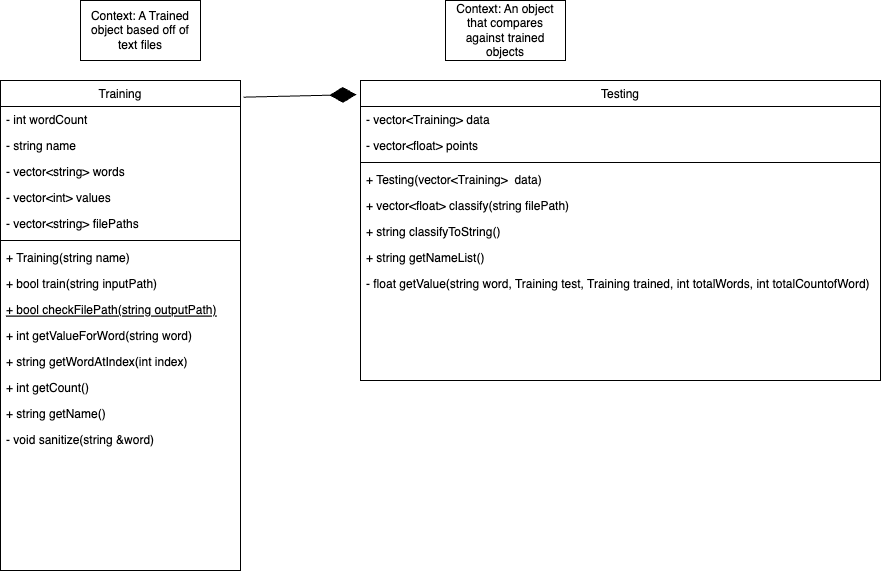

# Documentation for Final_Project_Octogon
Noah Dunham and Alex Leonida

All articles in "testing files" and "training files" owned and copyrighted by NPR.
You have no right to copy, share, download, upload, transform, or in any way claim your own any of these files nor the contents within.
NPR in no way is associated with this code, and does not necessarily support it's use.  
Link to NPR: https://www.npr.org/
  
  
*"test" and "classify" are used interchangably in this document.*  
*"testing file" is the same thing as a document we wish to classify*  
## Intended Use
This program is meant to classify text files into different catagories. The user is supposed to input which catagories to classify between, and then "train" the model with text that is known to be this classification. For example, the classification "food" might be trained with cooking articles, recipies, etc.
Once the model is "trained" with the files the user knows the classification of, the user can input files that they do not know the classification of and the program will predict which classification the file is of.
This program also has a "default train" and "default test" option to allow for testing of the program itself.
## Design
### UML Diagram

### 2 Classes
We utilized two classes in this program, Training and Testing. The Training class is used in the training phase, and each instance of a Training object represents a different catagory. Each Training instance contains all the relavent information about all the articles classified as that specific catagory (see the private variables in the UML diagram above). The Training class has the ability to take a document and parse for the word frequency.  
The Testing class represents the complete model with all the Training objects (and thus all the data that was used in training the model) stored in the vector "data". It then has the ability to take in documents and classify based on the training data. While this was not implemented, multiple different Testing instances would represent different models which could then be compared against eachother for accuracy.  

The two class approach uesd makes sense for numerous reasons. First, the training and testing phase are completly independet of one another when running the program, so it is intuitive to have the implemntaion also broken apart. More functionally, it makes sense for the same Training instance to be used in multiple Testing instances if the same catagory and training files are used in the same model.
### Word-based Points
This program classifies documents based off of the association of each word. It does this by assigning "points" to each word in the file that is to be classified (testing file). For example, if the word "cooking" appears in the test file, it might recieve .001 points for environment, 0 points for sports, and .2 points for food. These points are then added up for each catagory, and the document is classifed as the catagory with the highest points. We discuss how points are assigned below.  
This is a flawed aproach, but it works reasonably well. The problem is that words have different meanings based on the words around them (ex: "open book", meaning nothing to hide, is interpreted as "open" and "book"). The reason this is not taken into account is we do not have the knowledge nor time to deal with this. The core idea behind this approach is that words appear at different frequencies based on the document type ("cooking" appears at a high frequency in food than in sports).
### Points Formula
The way of assigning points is a critcal peice of the program. The formula is in the code as:
```cpp
test.getValueForWord(word) * trained.getValueForWord(word) * totalWords / trained.getCount() / totalCountOfWord / test.getCount()
```
Lets break this down. First, here are the meanings behind each term:
* test: The Testing object containg the data for the file to be classified
* trained: The Training object containing the data for the a catagory (like "sports")
* word: The word that appeared in the testing article  

*Note that this formula is ran for every different classification on each word. One run could be for "sports" points, then "food". This is because each catagory needs a running number of points for all the words in the testing document*  
  
*Also note that test includes an arraylist of all the words that appeared in the file to be classified, as well as the number of times that word appeared. This means that each 'word' will only be run through this formula once per catagory.*  
___
* test.getValueForWord(word): The number of times the word apeared in the file that we are classifying
* trained.getValueForWord(word): The number of times the word apeared in all the training files for a catagory
* totalWords: The total number of words (including duplicates) that were trained against in *all* classifications
* trained.getCount(): number of words that were trained against in the Training object (only the given catagory)
* totalCountOfWord: the number of times the word appeared across all the catagories
* test.getCount(): the number of words in the file to be classified.  
  
  
To start, the core of the formula is test.getValueForWord(word) * trained.getValueForWord(word) . This multiplies the number of times the word appears in teh tesing file by the number in the training file. This means that the more times that a word appears in the testing file that also appeared in the training files, the figher the score.  
However, this means that files with more words will have higher scores than those with fewer words. Because of this, we divide by both test.getCount() and trained.getCount() so that we are multiplying the *frequency* at which the words appear. Large testing files no longer have higher scores.  However, there is another problem. Consider the word "the". It will appear in all files at a high frequency. This means that all catagories will recieve a large number of points from common words like "the". Because of this, we divide by the totalCountOfWord. Now, the word "the" has much less weight because it appears in all articles at a high frequency.  
In doing this, we have introduced one last problem. If we have 1,000,000 training files in one model and 1,000 in another model, the files will be classified in a similar way, but the numbers are no longer comparable. To somewhat counter this, we multiply by totalWords.  
  
This formula is not the best formula. Ideally, we would test different models with the same training and testing files and different formulas against eachother (or get an AI to do it for us, this is machine learning). However, this formula worked well in our tests and we did not have the time to create variations of it. 
### Special Characters
This program deletes all characters that are not alphabetic (ex: ':', '?', '"', etc.). The idea is that words in quotes, at the end of sentences, and other places special characters appear are still releated to the topic (a quote in a food article is still related to food). However, we don't want to distinguish in the program between "toast" and "toast,", so we delete the ','.  
However, this program completly ignores words including a capital letter (ex: "Boston" is completly ignored in training). This is because names, places, and other proper nouns are all capitalized. We don't want "Bob" to be a large weight toward food because Bob was featured in the article. "Bob" is not related to food. This does cause a loss of words at the start of sentences, but we belive that this loss is negligably small and the benifits far outwiegh the cost of losing a few words per article. In the future, it would be benificial to be able to identify between proper nouns and normal words to be able to include all relavent words. Furthermore, multipart words such as "in-class" for example will be considered as one word, "inclass". 
### Default File Collection
We used the news site NPR (link: https://www.npr.org/) to collect all the default training and testing files. On Dec 6, we copied the text of the 40 most recent NPR articles by catagory into their respective training file folders. We then copied the 41st to 50th most recent articles into the respective testing file folders. NPR allows you to search by section for articles, so the classification of the articles was done by NPR.
## Assumptions
### Technical Assumptions
* The user follows the [UserGuide](./UserGuide.md) when running the program.
* The user is technically competent - can add files, build, run, interact with the terminal, and understands relative file paths.
* The user does not change the files, file names, nor the location of prexisting files.
* The user adds files in .txt form in valid locations within the FINAL_PROJECT_OCTOGON folder.
* The user's files do not include images, special characters, double spaces, etc.
* When prompted for a 0 or 1, the user enters a 0 or 1.
* When prompted for a file path, the user enters a valid file path.
* The user is using windows, or a system that supports spaces in file folder names, as well as "/" in file pathing
### Design Assumptions
* The 40 most recent articles in a catagory are representative of all articles in that catagory.
* The articles on NPR are representative of all articles about a given topic.
* Documents can be classified by the frequency at which words appear in that document.
* Word combinations ("full moon") have no additional impact on the classification beyond the induvidual words (full, moon).
* Documents can all be classified into exactly one class.
* The formula used to calculate "score" is valid - that is - the correct formula weights off of an adjusted word frequency function. 
* There is an equal frequency of words appearing at the start of a sentence as in the rest of the sentence (as the first word is ignored)  
  
*A lot of the design assumptions are not valid. This program is not the best possible version of a document classifier. These assumptions are not made because we think they are true, but because they provide a good framework within which we can make the project. If these assumptions where not made, we would either be spending time on pointless tasks or the project would turn into a project well beyond the scope of CS172.*

## User Manual
See [UserGuide.md](./UserGuide.md)
## Works Cited
All articles in "testing files" and "training files" owned and copyrighted by NPR.
You have no right to copy, share, download, upload, transform, or in any way claim your own any of these files noe the contents within.
NPR in no way is associated with this code, and does not necessarily support it's use.
Link to NPR: https://www.npr.org/  
* Used a [suggestion](https://discord.com/channels/687841742472478728/687842300881010736/1180007045462765668) by @lexvalkyrie on the CS172 discord to use cin.ignore() before using getline(cin,str).  
[main.cpp](./source/main.cpp) lines 200, 273.  
* In conjunction with the above resource, referenced cplusplus.com for both [string::getline](https://cplusplus.com/reference/string/string/getline/) and [istream::ignore](https://cplusplus.com/reference/istream/istream/ignore/).  
[main.cpp](./source/main.cpp) lines 200, 273.  
* Referenced [Ascii table](https://www.cs.cmu.edu/~pattis/15-1XX/common/handouts/ascii.html) for character to Ascii value conversion.  
[Training.cpp](./source/Training.cpp) lines 98 and 103.  
* Referenced Professor Scott's [in class code](https://whitgit.whitworth.edu/2023/fall/CS-172-1/in_class/-/tree/main/c18_file_IO_2) for various fileIO uses. Did not copy any code.


